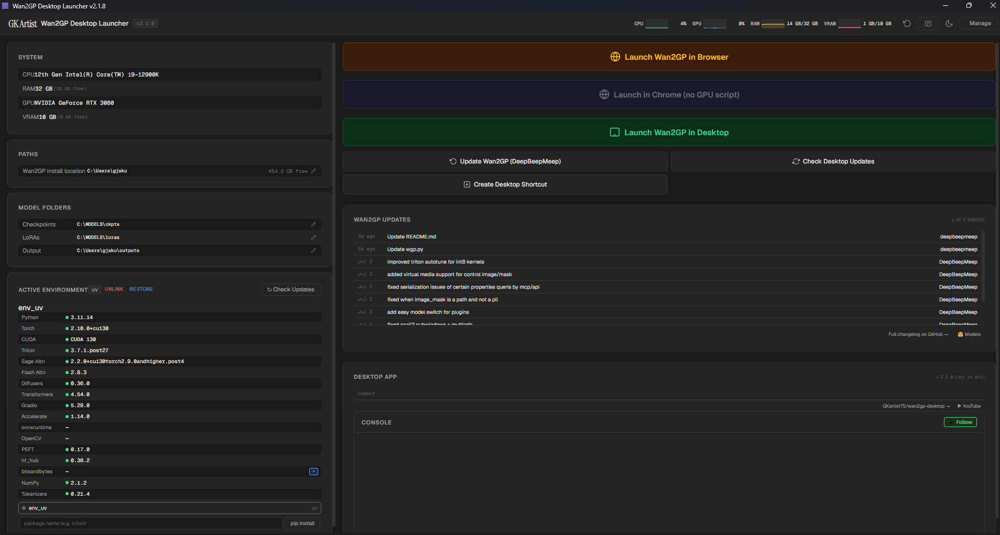
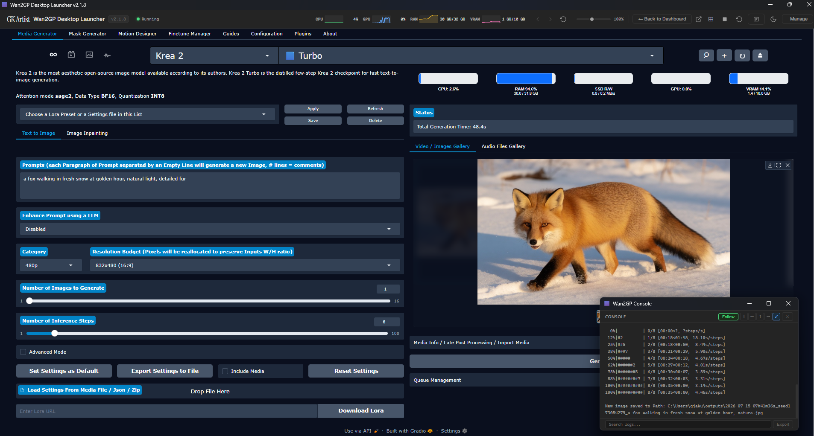
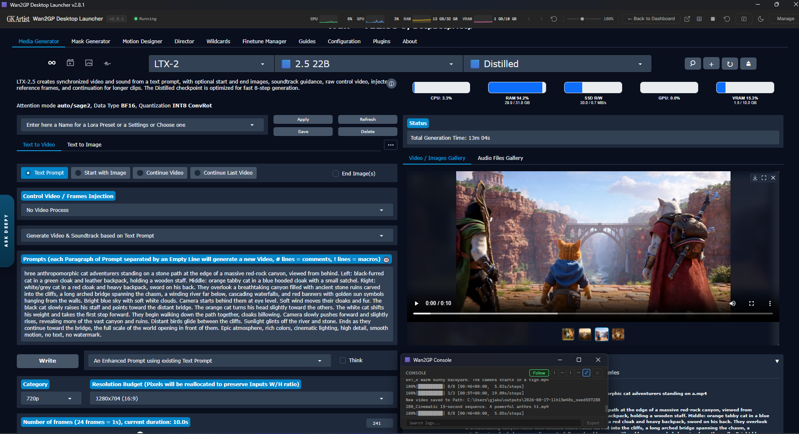
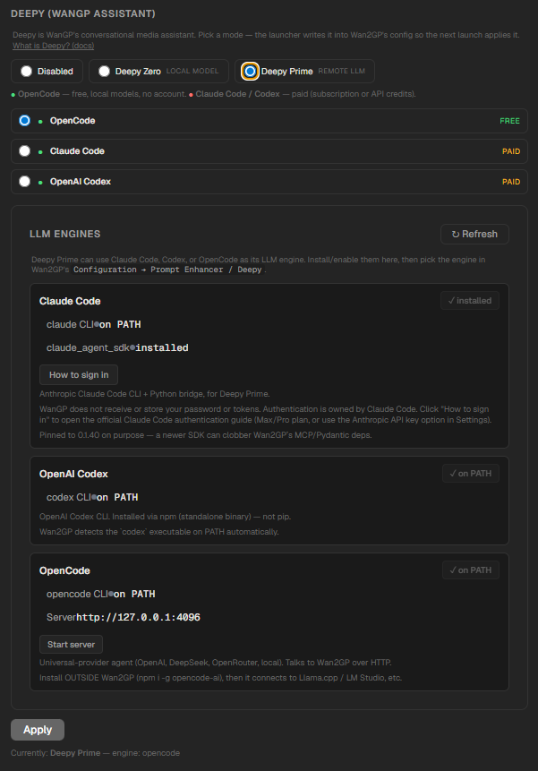
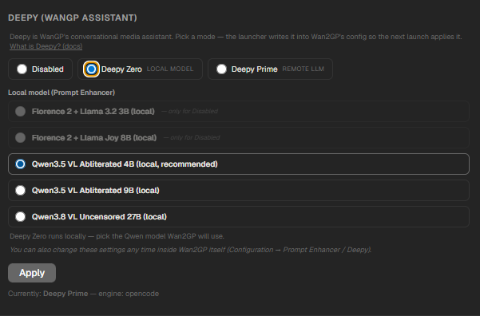
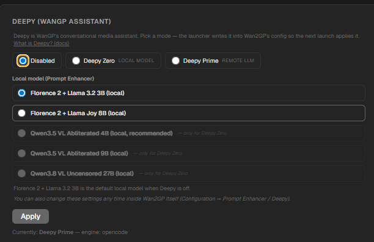
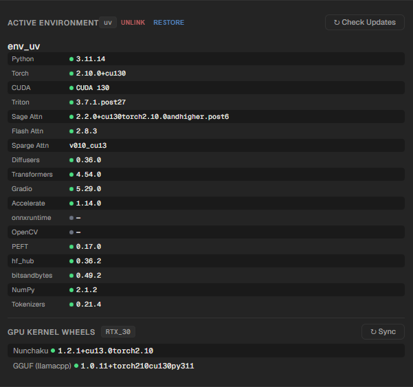

# Wan2GP Desktop Launcher

> The easiest way to run **Wan2GP (WanGP)** — the open-source generative video/image/audio toolkit — on Windows. One installer. One click to launch. Zero Python/CUDA setup.

[](https://github.com/GKartist75/wan2gp-desktop/releases) &nbsp; [](https://github.com/GKartist75/wan2gp-desktop/releases) &nbsp; [](LICENSE)

<p align="center">
  <a href="https://github.com/GKartist75/wan2gp-desktop/releases/latest" style="display:inline-block;padding:14px 36px;background:#2ea043;color:#fff;border-radius:8px;font-size:1.1rem;font-weight:600;text-decoration:none">
    ⬇ Download for Windows — Latest Release
  </a><br>
  <code>Wan2GP-Desktop-Launcher-*-win-x64.exe</code> · ≈ 90 MB · Windows 10 / 11<br>
  <small>⚠️ Unsigned installer — "unknown publisher" warning is normal for open-source without a code-signing cert.</small>
</p>

<p align="center">
  <a href="https://htmlpreview.github.io/?https://github.com/GKartist75/wan2gp-desktop/blob/main/infographic.html">📖 Visual walkthrough — install, Auto-Tune, dashboard & launch modes on one page →</a>
</p>

---

## Why Wan2GP? Why this launcher?

**WanGP by [deepbeepmeep](https://github.com/deepbeepmeep/Wan2GP)** is a one-stop super-app for open-source generative models — video, image, audio and TTS — with a full browser UI, queue, galleries, LoRAs, finetunes and plugins. It runs on as little as **6 GB VRAM** and supports old and new GPUs alike.

**This launcher handles it for you:**

- **One-click install** — detects GPU, shows plan, installs everything
- **Auto, per-GPU kernels** from WanGP's `setup_config.json`, re-synced on every update
- **Isolated `uv` env**, pinned deps, no PATH editing
- **One-click updates** in Dashboard / Manage → Updates
- **Install Wan2GP and Models (checkpoints, LoRAs, outputs) on any drive/folder you choose**
- **Auto-Tune** recommends VRAM/RAM profile and writes config for you

---

## Highlights — What you get with WanGP

Through the launcher you get the **full WanGP** — same models, same UI, same plugins. Nothing stripped.

| Modality | Supported models (via launcher) |
|---|---|
| **Video** | **Wan 2.1 / 2.2** + derivatives, **MiniMax H3** (FL2VA / Ref2VA), **LTX-2 / 2.3 / 2.5**, **HunyuanVideo 1 / 1.5**, **LongCat, Kandinsky, LTXV, MagiHuman, VACE** |
| **Image** | **Krea 2, Qwen Image, Z-Image, Flux 1 / 2** (Klein, Chroma), **SenseNova, Ideogram 4, HiDream, Flux Kontext** |
| **Audio / TTS** | **Qwen3 TTS, AceStep 1/2/XL, Omnivoice, IndexTTS 2/2.5, KugelAudio, HeartMula, Chatterbox, Minimax Music, Stable Audio 3** |

**Run on more hardware**
- **6 GB VRAM** is enough for select models — up to 24 GB+ for max quality/speed.
- **NVIDIA:** GTX 10xx / 16xx, RTX 20xx / 30xx / 40xx / 50xx. **AMD:** RDNA 2 / 3 / 3.5 / 4. **Apple Silicon** (via upstream).
- **Quantized checkpoints:** int8, fp8, GGUF, NV FP4, Nunchaku — architecture-aware downloads.
- **Full web UI:** galleries, reusable settings/templates, mask editor, background remover, pose/depth/flow, diarization, upsampling (RIFE/FlashVSR/Lanczos/SeedVR2), MMAudio/SeedVC, **20+ community plugins**, LoRAs, finetunes, generation queue, headless/API mode.

> Upstream docs: [WanGP README](https://github.com/deepbeepmeep/Wan2GP) · [Installation](https://github.com/deepbeepmeep/Wan2GP/blob/main/docs/INSTALLATION.md) · [Models](https://github.com/deepbeepmeep/Wan2GP/blob/main/docs/MODELS.md)

---

## Key features — What the launcher adds

- 🚀 **One-click install** — detects your GPU, shows exactly what it will install (Git, Python 3.11, PyTorch + CUDA, attention kernels), then does it. Missing Git/Python/uv? One click installs silently — no PATH editing. Reads NVIDIA RTX 20/30/40/50, AMD, Apple Silicon and picks the matching PyTorch + CUDA/ROCm build before installing.
- 🎯 **Always the right kernels** — per-GPU wheel set from WanGP's own `setup_config.json`. Re-syncs on install and every update. No stale wheels when upstream bumps them. Isolated Python 3.11 `uv` env with pinned deps (prebuilt wheels for `pygame` etc.).
- 📂 **Clean data layout** — `C:\Wan2GP` (app) + `C:\Wan2GP-Models` (models) by default, out of roaming AppData. **Both are pre-filled defaults — pick any drive/folder at install.**
- 🖥️ **Flexible launch** — Desktop (in-app), Browser, or External Terminal; pop-out, zoom, browser picker.
- 🔄 **Safe updates** — manual-only, version-aware. Nothing downloads without your action. Dashboard + **Manage → Updates** (WanGP core + launcher).
- 📂 **Paths migrate** — move installs between drives from Dashboard → Paths, no freeze, no leftovers, cross-drive safe.
- 🛡️ **Crash-proof UI** — renderer-crash watchdog, GPU-off recovery, no blank-screen regressions.

> **⚡ CUDA 13 stack on modern RTX cards.** Since v2.4.5, RTX 20/30/40/50 get **PyTorch 2.10 + CUDA 13** — SageAttention 2.2 (RTX 30/40) / 1.0.6 (RTX 20), FlashAttention 2.8.3, SpargeAttention (30/40/50), LightX2V (RTX 50), Nunchaku INT4/FP4 + **GGUF 1.0.13** + **bitsandbytes 0.49.2** (NF4). GTX 10/16 stay on **CUDA 12.8** (no R580 needed); every other NVIDIA card needs **R580+** and is checked before install.

---

## Download & Install

**Upgrading from v2.8.x?** v3.0 moved Wan2GP out of roaming AppData — see [`Migration & Troubleshooting` below](#-migration-v30--troubleshooting). Clean reinstall is recommended.

1. Download the `*.exe` from **Releases** (button at top).
2. Run it — pick install + models folders (or accept `C:\Wan2GP` / `C:\Wan2GP-Models`). The screen detects your GPU and lists exactly what it will install — all paths are editable.
3. Click **Install** (~5–20 min: clone → `uv` venv → PyTorch+CUDA → requirements → kernels → `wgp_config.json`).
4. Click **Launch** — **Desktop** (green, in-app) or **Browser** (amber).

No Python, no CUDA toolkit, no `pip` needed beforehand — the installer fetches them.
> 💡 Creates `Launch Wan2GP.bat` desktop shortcut to run without the launcher.

### Launch modes

- **Desktop** (green) — Wan2GP inside the launcher, with back/forward/reload, zoom 25–200% and pop-out to a separate window.
- **Browser** (amber) — visible console + auto-opens your browser when ready.
- **External Terminal** (blue) — real Windows Terminal / cmd via generated script; in-app LED + Stop kills by PID, closing the window also stops it.
- **No-GPU Chrome** — launch Chrome with GPU disabled to free VRAM for generation.
- **Browser picker** — detects Chrome, Edge, Firefox, Brave, Opera, Vivaldi.

### Where is everything? (v3.0+, defaults)

```
C:\Wan2GP\                      ← repo + launcher data (self-contained)
   ├─ wgp.py                    ← Wan2GP core
   ├─ env_uv\                   ← Python 3.11 venv (uv)
   ├─ wgp_config.json           ← settings (ckpts → C:\Wan2GP-Models\ckpts)
   ├─ desktop-config.json       ← launcher config
   └─ boot.log                  ← diagnostic

C:\Wan2GP-Models\               ← your large files (any drive you chose)
   ├─ ckpts\                    ← checkpoints
   ├─ loras\                    ← LoRAs
   └─ outputs\                  ← generated videos/images/audio
```
> `C:\Wan2GP` / `C:\Wan2GP-Models` are pre-filled defaults — Browse to any drive/folder at install or later via **Dashboard → Migrate to new location**. The dashboard shows a `MODELS` banner if it detects old AppData checkpoints.

### Screenshots





---

## ⚡ Auto-Tune — one click, right profile

**Manage → Auto-Tune** (or ⚡ on the dashboard) scans GPU/VRAM/RAM/kernels and recommends the optimal `wgp_config.json` settings. All three profile dropdowns (video/image/audio) stay editable before you Apply.

The **Manage → Settings** tab also holds the **GitHub token** field (lifts GitHub API rate limit for update checks — see [`Migration & Troubleshooting` below](#-migration-v30--troubleshooting)) and the **Desktop → Auto-update** toggle (launch-time checks / silent downloads / install-on-quit).

**How profiles work** — WanGP's memory manager (`mmgp`) uses 7 profiles trading VRAM for speed. Auto-Tune picks one from your VRAM × RAM:

| Profile | mmgp name | pinnedMemory | Budgets | Encoder Quant | Best for |
|---------|-----------|--------------|---------|---------------|----------|
| **P1** | HighRAM_HighVRAM | All modules | None | No | ≥24GB VRAM + 64GB+ RAM (max performance) |
| **P2** | HighRAM_LowVRAM | All modules | `{"*": 3000}` | No | 12–23GB VRAM + 64GB+ RAM |
| **P3** | LowRAM_HighVRAM | Transformer only | None | Yes | ≥24GB VRAM + 32–63GB RAM |
| **P3+** | VeryLowRAM_HighVRAM | Transformer only | No reserved mem | Yes | ≥24GB VRAM + <32GB RAM (RAM saver) |
| **P4** | LowRAM_LowVRAM | Transformer only | `{"*": 3000}` | Yes | 12–23GB VRAM + ≥32GB RAM (balanced, recommended) |
| **P4+** | LowRAM_LowVRAM+ | Transformer only | Tighter budgets | Yes | <12GB VRAM + ≥32GB RAM (VRAM saver) |
| **P5** | VerylowRAM_LowVRAM | None | `{"*": 3000, "transformer": 400}` | Yes | <12GB VRAM + <32GB RAM, or failsafe |

| VRAM ↓ \ RAM → | ≥64 GB | ≥32 GB | <32 GB |
|---|---|---|---|
| **≥24 GB** | P1 max perf | P3 | P3+ RAM saver |
| **12–23 GB** | P2 | **P4 balanced** | P5 |
| **<12 GB** | P4 | P4+ VRAM saver | **P5 failsafe** |

**Settings written** to `wgp_config.json`:
- `video_profile` / `image_profile` / `audio_profile` — profile `1, 2, 3, 3.5, 4, 4.5, 5`
- `transformer_quantization` — Scaled Int8 (recommended), FP8, NVFP4, or None
- `vae_config` — always **Auto** (runtime picks VAE tiling from real VRAM headroom)
- `vram_safety_coefficient` — `0.80` (≥12GB), `0.70` (<12GB), `0.60` (failsafe) — forwarded as `--vram-safety-coefficient` on every launch (Extra Launch Args win)

**Failsafe** — tick *"Prefer failsafe (P5 — maximum compatibility)"* to force P5 regardless of matrix, for hardware where the recommendation still crashes.

---

## 📊 Monitoring & control

- **Dockable console** — live server log, dock to bottom/left/top or float. Search, export, resize. Toggle <kbd>Ctrl+`</kbd> or topbar button.
- **Topbar sparklines** — CPU/GPU/RAM/VRAM mini real-time charts.
- **Running LED & Stop** — status light + one-click server stop.
- **System tray** — minimize to tray, auto-start with Windows, notifications on server ready/stop.
- **Keyboard shortcuts** — <kbd>Ctrl+`</kbd> terminal, <kbd>F12</kbd> DevTools picker, <kbd>Esc</kbd>/<kbd>Ctrl+W</kbd> close webview.
- **Maintenance** — update WanGP or Desktop Launcher from **Dashboard** or **Manage → Updates**, upgrade, reinstall, switch envs, or uninstall-with-backup from the UI. **Dashboard → Paths** migrates installs between drives.
- **Renderer-crash watchdog** — auto-reloads UI (bounded, no loops), restores mode and self-heals the embedded view. Generation is never touched — server runs in its own process.

---

## 🔧 GPU kernels — what gets installed per GPU

WanGP is faster with vendor kernels than stock PyTorch. The launcher reads WanGP's own `setup_config.json` and shows exactly what it will install — and re-syncs on every update (no stale wheels when upstream bumps one).

| Wheel | Version (v3.0) | What it does |
|-------|---------------|---------------|
| **Python** (uv) | `3.11.14` (RTX 20–50) / `3.10.9` (GTX 10) | venv interpreter |
| **PyTorch + CUDA** | `2.10.0` + CUDA 13.0 | tensor + GPU runtime |
| **Triton** | `latest` (3.7.1) | JIT for custom CUDA/attention kernels on Windows |
| **SageAttention** | `1.0.6` (RTX 20) / `2.2.0` (RTX 30–50) | fused attention — big speed-up |
| **SpargeAttn** | `0.1.0` | sparsity-aware speed-up alongside Sage |
| **FlashAttention** | `2.8.3` | memory-efficient exact attention for long/high-res |
| **Nunchaku** | `1.2.1` | SVD-quantized (NF4/SVDQ) runtime — 4/8-bit models |
| **GGUF llama.cpp CUDA** | `1.0.13` | CUDA GGUF kernels (Stream-K, quantized KV-cache) |
| **LightX2V** | `0.0.2` | FP4 kernels — **RTX 50xx / sm120+ only** |
| **bitsandbytes** | `0.49.2` | 8-bit/NF4 dequant for NF4 checkpoints |

**Per-GPU set:** RTX 20 → Sage 1.0.6 + Flash + Nunchaku + GGUF + bnb. RTX 30/40 → add Sparge + Sage 2.2.0. RTX 50 → add LightX2V. All get bitsandbytes. Versions track `setup_config.json` — next update installs new wheels automatically.

**What the 1-click covers (vs manual guide):**

| Manual `INSTALLATION.md` | Launcher does |
|---|---|
| Minimal install (clone + venv + PyTorch + `requirements.txt`) | Clones → `uv` venv (Py 3.11.14 for RTX 20–50, 3.10.9 for GTX 10) → PyTorch + `requirements.txt` |
| Triton | `triton-windows` (pinned `<3.3` on RTX 20/30, latest on 40/50) |
| SageAttention | RTX 20 → 1.0.6, RTX 30–50 → 2.2.0 (GTX 10 skipped) |
| SpargeAttn | matching `cu130`/`py3.11` wheel |
| FlashAttention | `2.8.3` prebuilt wheel |
| GGUF llama.cpp CUDA | `1.0.13` (Stream-K, quantized KV-cache) — synced on every update |
| Nunchaku / bitsandbytes / LightX2V | Nunchaku 1.2.1 + bnb 0.49.2 (all); LightX2V 0.0.2 on RTX 50xx / sm120+ only |

**PyTorch matrix:** RTX 20/30/40/50 → Py 3.11.14 + PyTorch 2.10 + CUDA 13.0/13.1 · GTX 10xx → Py 3.10.9 + PyTorch 2.7.1 + CUDA 12.8. Avoids 2.8.0 (RAM leak) + 2.9.0 (VAE VRAM bug).

> GTX 10/16 stay on legacy **CUDA 12.8** (no R580). Modern RTX needs **R580+** (checked before install). Upstream: [INSTALLATION.md](https://github.com/deepbeepmeep/Wan2GP/blob/main/docs/INSTALLATION.md)

---

## Deepy — your offline agent

Configure without editing JSON: **Settings → Deepy** or the Dashboard card.

- **Disabled** — Deepy off; keeps local Prompt Enhancer (Florence 2 + Llama 3.2 3B / Joy 8B).
- **Deepy Zero** — local, no account/key. Qwen3.5 VL 4B (recommended) / 9B / Qwen3.8 VL 27B.
- **Deepy Prime** — remote LLM via **OpenCode** (free, local models), **Claude Code** or **Codex** (paid). Prime exposes WanGP's MCP tools.

Switching live-re-renders the selector; **Apply** writes a consistent `wgp_config.json` (with backup). Also editable inside WanGP: *Configuration → Prompt Enhancer / Deepy*.

| Disabled — local Prompt Enhancer | Deepy Zero — local Qwen | Deepy Prime — remote LLMs | Active env |
|---|---|---|---|
|  |  |  |  |

**Remote LLM engines (Deepy Prime):**
- 🟢 **OpenCode — free & local.** Routes to Llama.cpp / LM Studio (zero cost, no API key) or cloud. `Install via npm` → `Start server` → `http://127.0.0.1:4096`.
- 💲 **Claude Code — paid.** Max/Pro subscription *or* Anthropic API key (pay-per-token).
- 💲 **OpenAI Codex — paid.** Own CLI + OpenAI account.

> New to this? Start with **OpenCode** — the only zero-cost option.

---

## 📦 Migration (v3.0) & Troubleshooting

<details>
<summary><b>v3.0 folders moved</b> — old AppData → <code>C:\Wan2GP</code> + <code>C:\Wan2GP-Models</code> (click to expand)</summary>

| What | Before (v2.8.x) | Now (v3.0+) |
|------|----------------|------------|
| Repo + venv + config | `%APPDATA%\wan2gp-desktop\Wan2GP\Wan2GP` | **`C:\Wan2GP`** *(default, any drive you choose)* |
| Checkpoints | `<repo>\ckpts` | **`C:\Wan2GP-Models\ckpts`** |
| LoRAs / Outputs | `<repo>\loras` / `outputs` | **`C:\Wan2GP-Models\loras` / `outputs`** |

Roaming AppData was bad for 10–100s GB of models (sync/quota). New defaults are top-level, separate, and **all Browse-editable** at install or via **Dashboard → Migrate to new location**.

**Preferred upgrade:** Manage → Uninstall (keep models) → close launcher → run new `.exe` → fresh `C:\Wan2GP` → point `ckpts` at `C:\Wan2GP-Models`. Experimental in-app Migrate also exists (back up first, no guarantee). v3.0.0 auto-migrated, v3.0.1 shows a Migrate dialog instead (no auto-move).

**Auto-update & GitHub token:** launcher checks `wan2gp-desktop/releases/latest` + upstream `Wan2GP` commits (cached 5 min). Anonymous GitHub API is 60 req/h/IP — you'll see *rate limited* if you restart often. Fix: **Manage → Settings → GitHub token** (classic PAT, `public_repo` scope) → Save → Restart → 5000 req/h on your token. Token is stored locally in `desktop-config.json`, never shipped in the `.exe`.

</details>

<details>
<summary><b>Troubleshooting</b> — Z-Image crash, blank window (click to expand)</summary>

**Z-Image crash** `Input type (BFloat16) and bias type (Half) should be same` — known upstream bug (VAE loaded fp16 but latents are bf16 for `ZImageTurbo_quanto_bf16_int8`). **Launcher fixes it automatically** since v2.2.4: forces Z-Image VAE to bf16 at bootstrap (`[bootstrap] z-image VAE dtype fix APPLIED`). No action needed. Permanent fix is upstream [PR #2095](https://github.com/deepbeepmeep/Wan2GP/pull/2095).

**Blank / black window after update** (title bar only): update left a locked `app.asar`. **Uninstall → reinstall latest `.exe` with launcher fully closed.** Still blank? Check `%LOCALAPPDATA%\Wan2GP Desktop Launcher\boot.log`: `ready-to-show` without `first-paint` = presentation class (create empty `%USERPROFILE%\.wan2gp-desktop-gpu-off` to disable HW accel); `did-fail-load` = corrupt bundle → reinstall. v2.8.5+ releases handles before swap and force-commits first frame to prevent both.

No prerequisites needed — launcher installs Git/Python/uv/Miniconda for you. For manual prerequisite help: [PREREQUISITES.md](PREREQUISITES.md).

</details>

---

## 🔥 What's New

> Full history: [docs/changelog.md](docs/changelog.md) · Each version below links to its standalone notes.

- **[v3.1.6](changelogs/CHANGELOG-v3.1.6.md)** — Env hint moved/grey + smaller Check Updates + Desktop Full/Quick (delta vs 93 MB full) + deduped launch check + Shift+local.
- **[v3.1.5](changelogs/CHANGELOG-v3.1.5.md)** — Full 93 MB update + sha512 verify (no blockmap delta) — fixes `This app can't run` after 3.1.3→3.1.4 auto-update.
- **[v3.1.4](changelogs/CHANGELOG-v3.1.4.md)** — Minimal Desktop (backgroundThrottling only), console mirrors Terminal, auto-check + 5h polling with green dot, autoUpdate on by default.
- **[v3.1.3](changelogs/CHANGELOG-v3.1.3.md)** — **Manage → Updates** tab, **Dashboard → Paths** non-blocking migrate (cross-drive, no leftovers), H3 Desktop shim, atomic config writes, GH_TOKEN leak fix, async GPU profile.
- **[v3.1.2](changelogs/CHANGELOG-v3.1.2.md)** / **[v3.1.1](changelogs/CHANGELOG-v3.1.1.md)** — Fix OpenCode/Codex `Install via npm` + `Start server` on spaced Node paths (`C:\Program Files\nodejs`) via `services/spawn-cmd.js`.
- **[v3.0.9](changelogs/CHANGELOG-v3.0.9.md)** — Drive-root guard, co-located `UV_CACHE_DIR` (no hardlink warning), Manage → General Purge/Remove uv cache.
- **[v3.0.0](changelogs/CHANGELOG-v3.0.0.md)** — **Breaking:** self-contained layout. Default `C:\Wan2GP` + separate `C:\Wan2GP-Models` (both user-selectable). Fresh per-GPU kernels from `setup_config.json`.

<details>
<summary>Older — v2.8 / v2.6</summary>

- **v2.8.7** — Blank-screen root cause fixed (nested `.screen` regression).
- **v2.8.5** — In-app update no longer blanks the launcher.
- **v2.8.2** — GPU-compositor first-present fix + watchdog.
- **v2.8.1** — AMD installs match AMD guide (NF4 kernels).
- **v2.6.0** — Install/update/uninstall freeze fixes; VAE on Auto.

See [docs/changelog.md](docs/changelog.md) for full list.

</details>

---

## 🛠 Build from source

```bash
git clone https://github.com/GKartist75/wan2gp-desktop.git
cd wan2gp-desktop
npm install
npm start          # dev
npm run build:win  # Windows NSIS installer
```
For a release with `latest.yml` (auto-update): `GH_TOKEN=*** ./scripts/release-win.sh 3.0.9` — tags, pushes, and uploads `exe` + `latest.yml` + blockmap.

---

## Documentation

| Page | What's inside |
|------|---------------|
| [Changelog](docs/changelog.md) | Full version history (newest first) — also summarized in [`🔥 What's New`](#-whats-new) above |
| [Upstream WanGP docs](https://github.com/deepbeepmeep/Wan2GP) | Installation, Models, Prompts, Deepy, LoRAs, Finetunes, CLI |
| [PREREQUISITES.md](PREREQUISITES.md) | Manual prerequisite troubleshooting (if auto-install fails) |

---

## Credits & License

Wan2GP Desktop Launcher wraps [Wan2GP](https://github.com/deepbeepmeep/Wan2GP) by deepbeepmeep. Released under the same [License](LICENSE).

Discord: [WanGP Community](https://discord.gg/g7efUW9jGV) · X: [@deepbeepmeep](https://x.com/deepbeepmeep) · Site: [wangp.ai](https://wangp.ai/)
